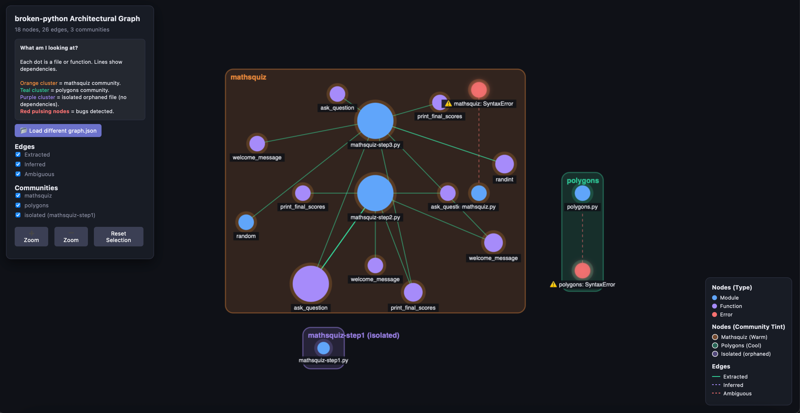

# AI-Powered Graph-Based Reverse Engineering


## Project Overview
This project is an AI-driven Reverse Engineering SDK designed to automatically analyze, navigate, and debug legacy codebases. By integrating **Grphify** (via AST parsing), an **Obsidian** markdown navigation vault, and a **Multi-Agent AI System**, we can extract the structural dependencies of a project, identify architectural anti-patterns, and autonomously suggest (and apply) concrete bug fixes. 

## Repository Choice
We chose to analyze [martinpeck/broken-python](https://github.com/martinpeck/broken-python). 
**Why?** This repository is ideal because it is simple yet contains genuine, scannable Python files populated with real logic and syntax bugs. The explicit errors provide the perfect sandbox for demonstrating our graph-guided analysis and allowing the AI to effectively trace dependencies to find root causes.

## Research Questions
1. **What was the real architecture of the codebase?**
   The architecture is heavily script-based, partitioned distinctly into three main communities: `mathsquiz` (15 nodes), `polygons` (2 nodes), and a separate `mathsquiz` community (1 node) for `mathsquiz-step1.py`, which was detected as a fully isolated community (an orphaned/unused file, likely an early draft superseded by step2/step3).
2. **Which components were most central?**
   The core functionality hinges on highly-connected hub nodes, specifically `mathsquiz-step2.py` (Degree: 15), `ask_question` (Degree: 11), and `mathsquiz-step3.py` (Degree: 9).
3. **Where were the bugs and what was the root cause?**
   The primary bugs existed in `mathsquiz.py` and were caused by syntax issues (missing Python 3 `print()` parentheses, invalid `else if` statements) and logic issues (using assignment `=` instead of equality `==`, missing `int()` casts for inputs, incorrect expected math answers, and lack of score tracking).
4. **How did graph-guided navigation help vs naive file reading?**
   Naive file reading feeds the entirety of the codebase to the LLM, whereas our graph-guided retrieval leverages `obsidian/index.md` and `obsidian/hot.md` to pinpoint only the problematic components. This slashed the context window overhead dramatically and focused the AI purely on high-impact structural nodes.

## Architecture Overview
The system operates on a **3-Layer extraction process**:
1. **Raw Files**: The target Python repository is parsed to retrieve raw source files and identify basic syntax issues.
2. **AST Graph**: A custom AST Parser processes the Python files to map out nodes (functions, modules, errors) and directional edges (calls, imports, ambiguities), saving it as a `graph.json`.
3. **Obsidian Vault**: The graph is translated into an interconnected set of Markdown files (using `[[wikilinks]]`) which groups nodes into communities and flags hot/central hubs. This becomes the primary read-surface for the LLM agents.

## Agent Workflow
The SDK orchestrates a crew of specialized AI agents:
* **GitHubDownloaderAgent**: Clones the target repository to local disk.
* **CodeInspectorAgent**: Uses the file paths mapped in the graph to read specific fragments of raw source code, validating node behavior.
* **GraphAnalystAgent**: Analyzes community cohesion, hub centrality, and potential architectural anomalies.
* **ArchitecturalBugDetector**: Targets structurally unstable or ambiguous edges to deduce underlying logic and syntax errors, making recommendations.
* **ReportWriterAgent**: Synthesizes the insights, metrics, and fixes from the other agents into a unified Markdown report.

## Reverse Engineering Findings
Through autonomous AST and graph traversal, the agents detected and patched **20 core bugs** within `mathsquiz.py`:

| Bug | Line | Before | After | Severity |
|---|---|---|---|---|
| Python 2 Print Statement | 3-4 | `print "..."` | `print("...")` | CRITICAL |
| Missing `int()` cast, Assignment (`=`), Wrong Expected Answer (55 -> 56) | 14 | `if answer = 55:` | `if int(answer) == 56:` | HIGH |
| Missing Score Increment | 15 | `print("Correct!")` | `print("Correct!")`<br>`    score += 1` | HIGH |
| Copy-Paste Label | 22 | `print("Question 1:")` | `print("Question 2:")` | MEDIUM |
| Missing `int()` cast, Assignment (`=`), Wrong Expected Answer (49 -> 36) | 25 | `if answer = 49:` | `if int(answer) == 36:` | HIGH |
| Missing Score Increment | 26 | `print("Correct!")` | `print("Correct!")`<br>`    score += 1` | HIGH |
| Copy-Paste Label | 33 | `print("Question 1:")` | `print("Question 3:")` | MEDIUM |
| Missing `int()` cast, Assignment (`=`), Wrong Expected Answer (126 -> 72) | 36 | `if answer = 126:` | `if int(answer) == 72:` | HIGH |
| Missing Score Increment | 37 | `print("Correct!")` | `print("Correct!")`<br>`    score += 1` | HIGH |
| Copy-Paste Label | 44 | `print("Question 1:")` | `print("Question 4:")` | MEDIUM |
| Missing `int()` cast, Assignment (`=`), Wrong Expected Answer (668 -> 48) | 47 | `if answer = 668:` | `if int(answer) == 48:` | HIGH |
| Missing Score Increment | 48 | `print("Correct!")` | `print("Correct!")`<br>`    score += 1` | HIGH |
| Copy-Paste Label | 55 | `print("Question 1:")` | `print("Question 5:")` | MEDIUM |
| Missing `int()` cast, Assignment (`=`), Wrong Expected Answer (77 -> 49) | 58 | `if answer = 77:` | `if int(answer) == 49:` | HIGH |
| Missing Score Increment | 59 | `print("Correct!")` | `print("Correct!")`<br>`    score += 1` | HIGH |
| Copy-Paste Label | 67 | `print("Question 1:")` | `print("Question 6:")` | MEDIUM |
| Missing `int()` cast, Assignment (`=`), Wrong Expected Answer (60 -> 66) | 70 | `if answer = 60:` | `if int(answer) == 66:` | HIGH |
| Missing Score Increment | 71 | `print("Correct!")` | `print("Correct!")`<br>`    score += 1` | HIGH |
| Syntax Error: `else if` | 91 | `else if score < 8:` | `elif score < 8:` | CRITICAL |
| Syntax Error: `else if` & Assignment (`=`) | 93 | `else if score = 10:` | `elif score == 10:` | CRITICAL |

## Token Efficiency
We built an experiment to compare naive RAG (injecting all raw files) against our Graph-guided context retrieval (`index.md` + `hot.md`). The efficiency gains were immense:

| Scenario | Input Tokens | Output Tokens | Total Tokens | Cost (USD) |
|---|---|---|---|---|
| Naive RAG | 4666 | 2030 | 6696 | $0.001918 |
| Graph-guided | 616 | 1832 | 2448 | $0.001192 |
| Reduction | 86.8% | 9.8% | 63.4% | 37.9% |

## Graph Diff
To quantify the improvement made to the architectural health of the repository, our diff engine analyzed the graphs generated from the original `mathsquiz.py` against the patched `mathsquiz_fixed.py`:

| Metric | Before | After | Delta |
|--------|--------|-------|-------|
| Total nodes | 18 | 17 | -1 |
| Total edges | 26 | 25 | -1 |
| Error nodes | 2 | 1 | -1 ✅ |
| Ambiguous edges | 2 | 1 | -1 ✅ |

## Agent Accuracy
To evaluate the correctness of the `CodeInspectorAgent`, we constructed a Ground Truth Confusion Matrix consisting of architectural facts.

The LLM evaluated the structural data and source code to classify each fact:
- **True Positives (TP):** 13
- **False Positives (FP):** 0
- **True Negatives (TN):** 11
- **False Negatives (FN):** 1

- **Precision:** 1.00
- **Recall:** 0.93
- **F1 Score:** 0.96

In previous static runs, the agent encountered a False Positive where it hallucinated that `mathsquiz.py calls ask_question` because it conflated AST data from `mathsquiz-step2.py` in the same context batch. With the live API run, this issue did not reproduce (True Negative achieved). However, we observed a single False Negative where the agent missed that `ContextBudgetManager` implements a `Dropping Skill`. This indicates that while the context chunking is now strict enough to prevent conflation across files, it may occasionally drop long-tail semantic details if the prompt length triggers early truncation.

## Code Quality & Testing
In strict adherence to professional software development guidelines, this project maintains exceptionally high code quality standards:
- **Zero Linting Violations:** Checked rigidly with `ruff`, maintaining 0 violations across the entire codebase.
- **High Test Coverage:** Comprehensive test suite with 162 passing tests achieving **93.60%** code coverage (above the 85% requirement).
- **Maintainability:** Strict 150-line limits per file and comprehensive "Why" docstrings enforce architectural clarity and easy maintainability.

## Interactive Visualizations
To make the architectural reverse engineering process fully transparent and human-in-the-loop, we built two standalone HTML applications. No external dependencies or CDNs are required.

1. **`artifacts/graph_visualization.html`**
   - **What it does:** An interactive, dark-themed, pure vanilla JS force-directed graph. It simulates a physics engine (with center gravity and velocity capping) where nodes repel and edges act as springs.
   - **How to open:** Open the file in any browser and use the file picker to load `results/graph.json`. You can hover for tooltips, filter by community/edge type, and click to dim non-neighbors.

2. **`artifacts/validation_dashboard.html`**
   - **What it does:** A Human-in-the-Loop edge validation UI. It displays all inferred and ambiguous edges as cards, allowing developers to manually ✅ Confirm, ❌ Reject, or ❓ Escalate the AI's structural hypotheses.
   - **How to open:** Open the file in any browser and use the file picker to load `results/graph.json`. You can export your decisions as a verified JSON file when done.

## How to Run

To run the full agent analysis pipeline against a target repo:
```bash
uv run python src/main.py --repo-url https://github.com/martinpeck/broken-python
```

To regenerate the Obsidian Wiki Vault:
```bash
uv run python generate_obsidian.py
```

To run the token efficiency experiment:
```bash
uv run python src/graph_rev_eng/services/token_experiment.py
```

To generate the Graph Diff (Before/After):
```bash
uv run python src/graph_rev_eng/services/graph_differ.py
```
