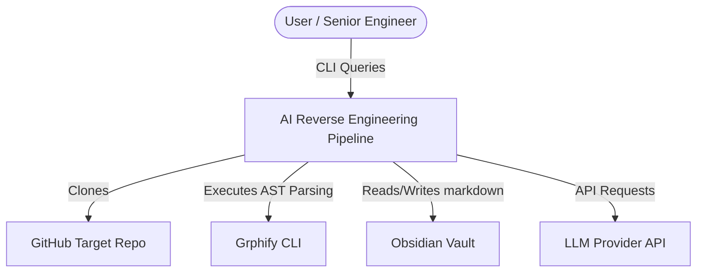
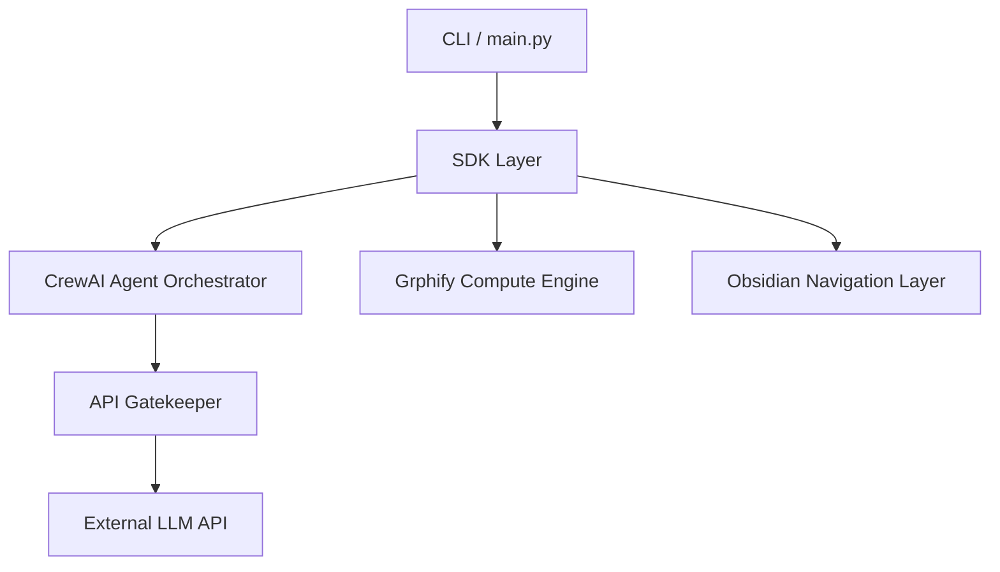
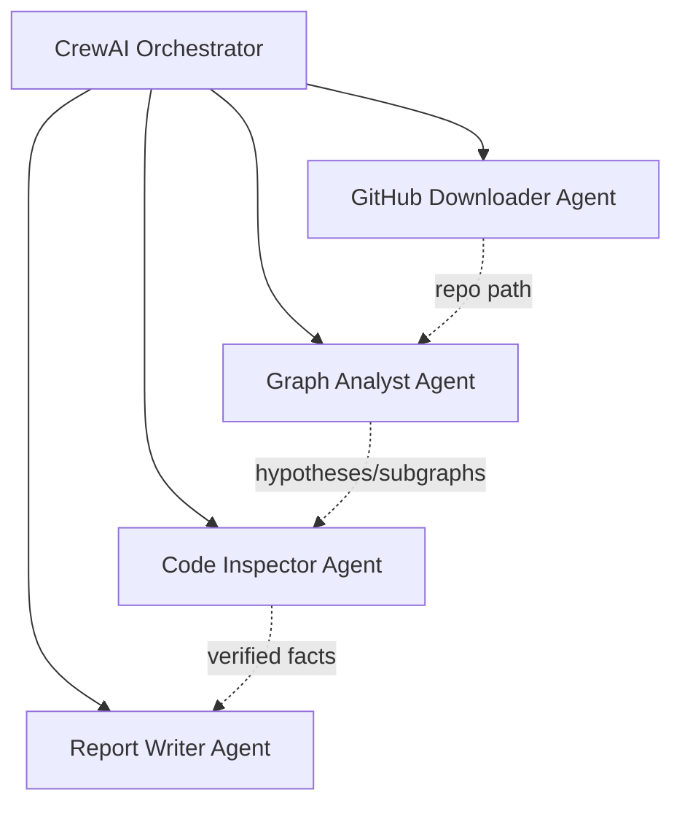
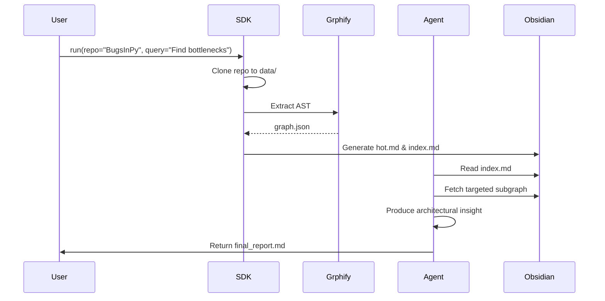
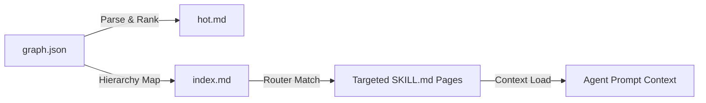

# Architecture & Planning Document (PLAN.md)

## 1. System Architecture Diagrams

### 1.1 C4 Context Diagram
Shows the system in relation to the external world.



### 1.2 C4 Container Diagram
Shows the high-level containers within the AI Pipeline.



### 1.3 C4 Component Diagram (Agent Orchestrator)
Shows the internal structure of the multi-agent system.



### 1.4 Main Workflow Sequence Diagram
Illustrates the pipeline from cloning to final report.



### 1.5 Data Flow Diagram
Tracks the lifecycle of knowledge data.



## 2. Three-Layer Architecture
The system enforces a strict separation of concerns regarding knowledge storage:
1.  **Raw Files Layer:** The unmodified source code cloned from GitHub. Heavy, unstructured, token-expensive.
2.  **Grphify Layer (`graph.json`):** The structured mathematical representation of the code. Eliminates noise but lacks human readability.
3.  **Obsidian Layer (`.md` files):** The semantic navigation layer. Converts graph JSON into hyperlinked Markdown pages, allowing both human operators and LLM agents to traverse knowledge logically.

## 3. Architectural Decision Records (ADRs)

### ADR 1: CrewAI vs. LangGraph
*   **Context:** We need a multi-agent framework to separate concerns (downloading vs analyzing vs reporting).
*   **Decision:** CrewAI was chosen over LangGraph.
*   **Rationale:** Our pipeline is predominantly sequential (Clone -> Extract -> Analyze -> Report). CrewAI excels at declarative, role-playing sequential processes out-of-the-box, whereas LangGraph's state-machine flexibility adds unnecessary complexity for this specific linear workflow.

### ADR 2: Grphify over Naive RAG
*   **Context:** Codebases exceed token limits. We need a retrieval method.
*   **Decision:** Use Grphify AST extraction instead of vector-based naive RAG.
*   **Rationale:** RAG chunks code textually, destroying structural relationships (e.g., who imports what). Grphify provides deterministic, structural graph data, allowing agents to reason about architecture perfectly without hallucinating dependencies.

### ADR 3: Index-First Retrieval over Full-Context Loading
*   **Context:** Agents need to find relevant information without loading the whole graph.
*   **Decision:** Enforce Index-First Retrieval.
*   **Rationale:** Loading the full graph bloats the prompt. Forcing the agent to read `index.md` first acts as a cognitive routing step, ensuring it only loads the 2-3 subgraphs strictly necessary for the task, drastically reducing token spend.

### ADR 4: Micro-Module Splitting (150-Line Limit Enforcement)
*   **Context:** Strict architectural constraint to keep all files ≤ 150 lines of code.
*   **Decision:** Extract cohesive logic into dedicated helper modules (e.g., `bug_rules.py`, `inspector_helpers.py`, `analyst_helpers.py`, `improvement_loop.py`, `crew_steps.py`, `graph_differ_format.py`).
*   **Rationale:** Keeps the core orchestrator classes and main services small and highly focused while avoiding massive logic dumps in a single file. Reduces cognitive load and enforces strict single responsibility.

## 4. API Gatekeeper Interface

The `ApiGatekeeper` acts as the sole chokepoint for all external LLM network traffic, enforcing strict rate limits and capturing token metrics.

```python
class RateLimitConfig:
    version: str
    requests_per_minute: int
    requests_per_hour: int
    concurrent_max: int
    retry_after_seconds: int
    max_retries: int

class QueueStatus:
    queued_requests: int
    is_throttled: bool

class ApiGatekeeper:
    def __init__(self, config: RateLimitConfig):
        # Initializes queues and threading locks
        pass

    def execute(self, api_call: Callable, *args, **kwargs) -> Any:
        # 1. Check rate limits
        # 2. Block/Queue if necessary
        # 3. Execute with exponential backoff
        # 4. Log token usage
        pass

    def get_queue_status(self) -> QueueStatus:
        # Returns current backpressure metrics
        pass
```
